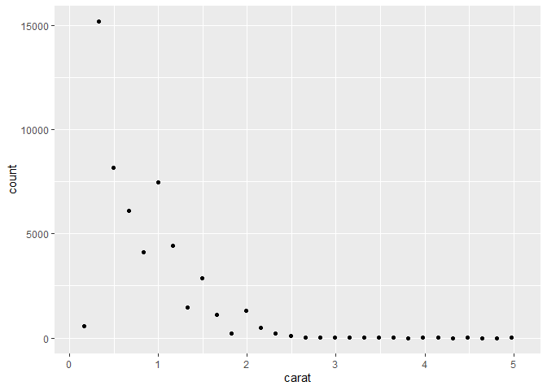
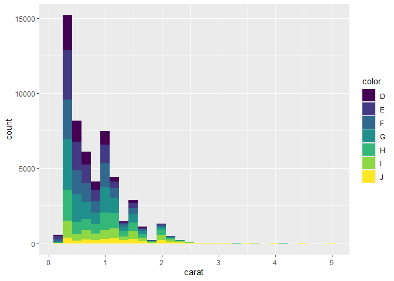
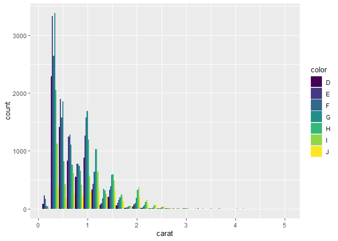

DSC1105 - Formative Assessment 3
================
MAYOL, JOSE RAPHAEL J.
2025-02-28

Before starting, we will first have to initialize ggplot for the
histograms as well the *diamonds* dataset itself.

``` r
library(ggplot2)
library(tidyverse)
```

    ## ── Attaching core tidyverse packages ──────────────────────── tidyverse 2.0.0 ──
    ## ✔ dplyr     1.1.4     ✔ readr     2.1.5
    ## ✔ forcats   1.0.0     ✔ stringr   1.5.1
    ## ✔ lubridate 1.9.4     ✔ tibble    3.2.1
    ## ✔ purrr     1.0.2     ✔ tidyr     1.3.1
    ## ── Conflicts ────────────────────────────────────────── tidyverse_conflicts() ──
    ## ✖ dplyr::filter() masks stats::filter()
    ## ✖ dplyr::lag()    masks stats::lag()
    ## ℹ Use the conflicted package (<http://conflicted.r-lib.org/>) to force all conflicts to become errors

``` r
diamonds
```

    ## # A tibble: 53,940 × 10
    ##    carat cut       color clarity depth table price     x     y     z
    ##    <dbl> <ord>     <ord> <ord>   <dbl> <dbl> <int> <dbl> <dbl> <dbl>
    ##  1  0.23 Ideal     E     SI2      61.5    55   326  3.95  3.98  2.43
    ##  2  0.21 Premium   E     SI1      59.8    61   326  3.89  3.84  2.31
    ##  3  0.23 Good      E     VS1      56.9    65   327  4.05  4.07  2.31
    ##  4  0.29 Premium   I     VS2      62.4    58   334  4.2   4.23  2.63
    ##  5  0.31 Good      J     SI2      63.3    58   335  4.34  4.35  2.75
    ##  6  0.24 Very Good J     VVS2     62.8    57   336  3.94  3.96  2.48
    ##  7  0.24 Very Good I     VVS1     62.3    57   336  3.95  3.98  2.47
    ##  8  0.26 Very Good H     SI1      61.9    55   337  4.07  4.11  2.53
    ##  9  0.22 Fair      E     VS2      65.1    61   337  3.87  3.78  2.49
    ## 10  0.23 Very Good H     VS1      59.4    61   338  4     4.05  2.39
    ## # ℹ 53,930 more rows

## 1. Create a histogram on the diamonds dataset, for example with

``` r
ggplot() + geom_histogram(aes(x = carat), data = diamonds)
```

    ## `stat_bin()` using `bins = 30`. Pick better value with `binwidth`.

<!-- -->

## Re-write this using the layer function like we did in class. Hint: if you don’t know what tthe default values for some of the aspects of the plot, examine p\$layers.

``` r
plot1 <- ggplot() + layer(
  geom = "bar",
  stat = "bin",
  mapping = aes(x = carat),
  data = diamonds,
  position = "stack"
)
plot1
```

    ## `stat_bin()` using `bins = 30`. Pick better value with `binwidth`.

<!-- -->

Using the layer function, the generated histogram is exactly the same as
the one using geom_histogram.

## 2. Remember that a histogram is a plot with stat_bin and geom_bar. Modify your histogram code so that it uses a different geom, for example geom_line or geom_point. This should be simple once you have the layer specification of a histogram.

``` r
plot2 <- ggplot() + layer(
  geom = "point",
  stat = "bin",
  mapping = aes(x = carat),
  data = diamonds,
  position = "stack"
)
plot2
```

    ## `stat_bin()` using `bins = 30`. Pick better value with `binwidth`.

<!-- -->

As observed, the plot now consists of points instead of the default
bars.

## 3. In your histogram (the one plotted with bars that you created in question 1), add an aesthetic mapping from one of the factor variables (maybe color or clarity) to the fill or color aesthetic.

``` r
plot3 <- ggplot() + layer(
  geom = "bar",
  stat = "bin",
  mapping = aes(x = carat, fill = color),
  data = diamonds,
  position = "stack"
)
plot3
```

    ## `stat_bin()` using `bins = 30`. Pick better value with `binwidth`.

<!-- -->

Here, we mapped the color factor variable to the fill aesthetic and
obtained the generated histogram. In this case, different colors were
assigned to each level of the color variable in the *diamonds* dataset.
This allows for a better visual of the distribution of colors within
each bin of the histogram, in this case the *carat* variable.

## 4. What is the default position adjustment for a histogram? Try changing the position adjustment in the histogram you created in question 3 to something different (hint: try dodge). 

``` r
plot4 <- ggplot() + layer(
  geom = "bar",
  stat = "bin",
  mapping = aes(x = carat, fill = color),
  data = diamonds,
  position = "dodge"
)
plot4
```

    ## `stat_bin()` using `bins = 30`. Pick better value with `binwidth`.

<!-- -->

The default position adjustment for a histogram is “stack”. Here, we
changed the position adjustment to “dodge” and obtained a histogram
placing the bars side-by-side instead of stacked on top of each other.
