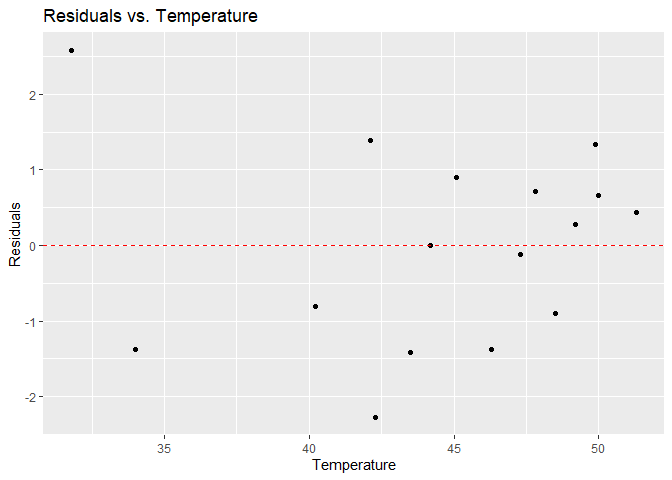

FA4
================
MAYOL, JOSE RAPHAEL J.
2025-03-04

## 1. Using the Mortality by Latitude data, make a plot of mortality index against mean average temperature. Is it hollow up or hollow down? Try to identify a transformation of one of the variables that will straighten out the relationship, and make a plot of the residuals to check for any remaining patterns.

First, we must import the csv file.

``` r
data <- read.csv("mortality_by_latitude.csv")
data
```

    ##    latitude mortality_index temperature
    ## 1        50            1025        51.3
    ## 2        51            1045        49.9
    ## 3        52            1004        50.0
    ## 4        53             959        49.2
    ## 5        54             870        48.5
    ## 6        55             950        47.8
    ## 7        56             886        47.3
    ## 8        57             892        45.1
    ## 9        58             789        46.3
    ## 10       59             846        42.1
    ## 11       60             817        44.2
    ## 12       61             722        43.5
    ## 13       62             651        42.3
    ## 14       63             681        40.2
    ## 15       69             673        31.8
    ## 16       70             525        34.0

``` r
library(ggplot2)
scatter_plot <- ggplot(data, aes(x=temperature, y=mortality_index)) +
  geom_point() +
  labs(title="Mortality Index vs. Temperature", x="Temperature", y="Mortality Index")
scatter_plot
```

<!-- -->

As can be observed, the data has mostly a direct relationship, but
visibly not a clear one yet. Additionally, the data curves upwards or is
**hollow up**. Let us try log-transforming temperature and see what
happens.

``` r
data$log_temperature <- log(data$temperature)

transformed_plot <- ggplot(data, aes(x=log_temperature, y=mortality_index)) +
  geom_point() +
  labs(title="Mortality Index vs. Log-Transformed Temperature", x="Log-Transformed Temperature", y="Mortality Index")
transformed_plot
```

<!-- -->

There is no apparent change, although we may get back to this
transformation later around the residual plotting process.

``` r
data$sqrt_temperature <- sqrt(data$temperature)

transformed_plot1 <- ggplot(data, aes(x=sqrt_temperature, y=mortality_index)) +
  geom_point() +
  labs(title="Mortality Index vs. Sqrt-Transformed Temperature", x="Log-Transformed Temperature", y="Mortality Index")
transformed_plot1
```

<!-- -->

Compressing the x-axis (temperature) seems to make the disparity more
extreme. Let us try log-transforming mortality index instead since it
has much bigger values.

``` r
data$log_mortality_index <- log(data$mortality_index)

transformed_plot2 <- ggplot(data, aes(x=temperature, y=log_mortality_index)) +
  geom_point() +
  labs(title="Log-Transformed Mortality Index vs. Temperature", x="Temperature", y="Log-Transformed Mortality Index")
transformed_plot2
```

<!-- -->

Log-transforming mortality index looks to be too extreme. Let us try
doing a square root transformation instead.

``` r
data$sqrt_mortality_index <- sqrt(data$mortality_index)

sqrt_plot <- ggplot(data, aes(x=temperature, y=sqrt_mortality_index)) +
  geom_point() +
  labs(title="Square Root Transformed Mortality Index vs. Temperature", x="Temperature", y="Square Root Transformed Mortality Index")
sqrt_plot
```

<!-- -->

The data seems to have equalized and compressed considerably more than
before. We can proceed to plotting the residuals.

``` r
model <- lm(sqrt_mortality_index ~ temperature, data = data)

data$residuals <- resid(model)

residual1 <- ggplot(data, aes(x = temperature, y = residuals)) +
  geom_point() +
  geom_hline(yintercept = 0, linetype = "dashed", color = "red") +
  labs(title = 'Residuals vs. Temperature',
       x = 'Temperature',
       y = 'Residuals')
residual1
```

<!-- -->

The residuals do not converge around the $y=0$ line in any way. This
must mean that our transformation of mortality index is appropriate. Let
us try going back to the **log-transformed temperature** instead.

``` r
model <- lm(log_temperature ~ mortality_index, data = data)
data$residuals <- resid(model)

residual2 <- ggplot(data, aes(x = mortality_index, y = residuals)) +
  geom_point() +
  geom_hline(yintercept = 0, linetype = "dashed", color = "red") +
  labs(title = 'Residuals vs. Mortality Index',
       x = 'Mortality Index',
       y = 'Residuals')
residual2
```

<!-- -->

This indicates that the model of log-transformed temperature vs
mortality index captures the relationship between the two variables much
better than all the other transformations we have done. When considering
the one outlier as an anomaly, the plot implies that there are **no
obvious patterns in the residuals**.

## 2. Using the same subset of the diamonds dataset, make a plot of log price as a function of carat with a loess smoother. Try several values for the span and degree arguments and comment briefly about your choice.

To begin, we need to load the *tidyverse* library.

``` r
library(tidyverse)
```

    ## ── Attaching core tidyverse packages ──────────────────────── tidyverse 2.0.0 ──
    ## ✔ dplyr     1.1.4     ✔ readr     2.1.5
    ## ✔ forcats   1.0.0     ✔ stringr   1.5.1
    ## ✔ lubridate 1.9.4     ✔ tibble    3.2.1
    ## ✔ purrr     1.0.2     ✔ tidyr     1.3.1
    ## ── Conflicts ────────────────────────────────────────── tidyverse_conflicts() ──
    ## ✖ dplyr::filter() masks stats::filter()
    ## ✖ dplyr::lag()    masks stats::lag()
    ## ℹ Use the conflicted package (<http://conflicted.r-lib.org/>) to force all conflicts to become errors

To recall, this is the *diamonds* dataset.

``` r
diamonds
```

    ## # A tibble: 53,940 × 10
    ##    carat cut       color clarity depth table price     x     y     z
    ##    <dbl> <ord>     <ord> <ord>   <dbl> <dbl> <int> <dbl> <dbl> <dbl>
    ##  1  0.23 Ideal     E     SI2      61.5    55   326  3.95  3.98  2.43
    ##  2  0.21 Premium   E     SI1      59.8    61   326  3.89  3.84  2.31
    ##  3  0.23 Good      E     VS1      56.9    65   327  4.05  4.07  2.31
    ##  4  0.29 Premium   I     VS2      62.4    58   334  4.2   4.23  2.63
    ##  5  0.31 Good      J     SI2      63.3    58   335  4.34  4.35  2.75
    ##  6  0.24 Very Good J     VVS2     62.8    57   336  3.94  3.96  2.48
    ##  7  0.24 Very Good I     VVS1     62.3    57   336  3.95  3.98  2.47
    ##  8  0.26 Very Good H     SI1      61.9    55   337  4.07  4.11  2.53
    ##  9  0.22 Fair      E     VS2      65.1    61   337  3.87  3.78  2.49
    ## 10  0.23 Very Good H     VS1      59.4    61   338  4     4.05  2.39
    ## # ℹ 53,930 more rows

We can now create the plot of log price as a function of carat with a
loess smoother. Let us try different values of spans and degrees.

``` r
plot_loess <- function(span, degree) {
  loess_fit <- loess(log(price) ~ carat, data = diamonds, span = span, degree = degree)
  
  diamonds$loess_pred <- predict(loess_fit)
  
  ggplot(diamonds, aes(x = carat, y = log(price))) +
    geom_point(alpha = 0.5) +
    geom_line(aes(y = loess_pred), color = "blue") +
    labs(title = paste("LOESS Smoother: span =", span, ", degree =", degree),
         x = "Carat",
         y = "Log(Price)")
}

plot_loess_1 <- plot_loess(0.3, 1)
plot_loess_2 <- plot_loess(0.5, 1)
plot_loess_3 <- plot_loess(0.7, 1)
plot_loess_4 <- plot_loess(0.5, 2)

library(gridExtra)
```

    ## 
    ## Attaching package: 'gridExtra'

    ## The following object is masked from 'package:dplyr':
    ## 
    ##     combine

``` r
grid.arrange(plot_loess_1, plot_loess_2, plot_loess_3, plot_loess_4, ncol = 2)
```

<!-- -->

**Comments:**

1.  **Top-left (span = 0.3, degree = 1)**

    - The curve follows the trend of data very closely, This is good
      when the finest details are needed, but also introduces ‘noise’.

2.  **Top-right (span = 0.5, degree = 1)**

    - This curve has slightly less localized smoothing than the
      top-left. However, it has the advantages of reducing sensitivity
      to local fluctuations while still retaining the overall trend in
      the dataset.

3.  **Bottom-left (span = 0.7, degree = 1)**

    - This curve is the most linear among all choices, making the
      relationship of *carat* and *price* appear most consistent. The
      biggest downside of this span choice is its lack of detail in
      capturing the variations in the actual data.

4.  **Bottom-right (span = 0.5, degree = 2)**

<!-- -->

    -   This plot has the same span as the top-right but with a degree of 2, hence making it quadratic. As expected, the curve takes on a parabolic shape, and to its detriment, completely goes against the original trend in the rightmost clusters of data. This risks overfitting the most.

For this dataset, the choice of **(span = 0.5, degree = 1)** seems to be
the most balanced and appropriate choice.

## 3. Compare the fit of the loess smoother to the fit of the polynomial + step function regression using a plot of the residuals in the two models. Which one is more faithful to the data?

Before we begin with the comparison, we will first need to decide on the
degree. For this purpose, we must use an ANOVA test comparing the
degrees 1 to 5.

``` r
fit_1 <- lm(log(price) ~ carat, data = diamonds)
fit_2 <- lm(log(price) ~ poly(carat, 2), data = diamonds)
fit_3 <- lm(log(price) ~ poly(carat, 3), data = diamonds)
fit_4 <- lm(log(price) ~ poly(carat, 4), data = diamonds)
fit_5 <- lm(log(price) ~ poly(carat, 5), data = diamonds)
anova(fit_1,fit_2,fit_3,fit_4,fit_5)
```

    ## Analysis of Variance Table
    ## 
    ## Model 1: log(price) ~ carat
    ## Model 2: log(price) ~ poly(carat, 2)
    ## Model 3: log(price) ~ poly(carat, 3)
    ## Model 4: log(price) ~ poly(carat, 4)
    ## Model 5: log(price) ~ poly(carat, 5)
    ##   Res.Df    RSS Df Sum of Sq        F    Pr(>F)    
    ## 1  53938 8508.4                                    
    ## 2  53937 3916.3  1    4592.1 69813.58 < 2.2e-16 ***
    ## 3  53936 3586.3  1     330.0  5017.20 < 2.2e-16 ***
    ## 4  53935 3556.4  1      29.9   453.85 < 2.2e-16 ***
    ## 5  53934 3547.6  1       8.8   133.96 < 2.2e-16 ***
    ## ---
    ## Signif. codes:  0 '***' 0.001 '**' 0.01 '*' 0.05 '.' 0.1 ' ' 1

All model comparisons have $p<0.05$ and thus our choice of degree does
not matter since nothing fits. Let us go with degree=2.

Since we deemed it as the most appropriate choice, then we will use the
loess smoother with span of 0.5 and degree of 1. Now we will compare its
fit to that of the polynomial + step function regression using their
residual plots.

``` r
loess_fit <- loess(log(price) ~ carat, data = diamonds, span = 0.5, degree = 1)
diamonds$loess_pred <- predict(loess_fit)

polynomial_fit <- lm(log(price) ~ poly(carat, 2) + cut, data = diamonds)
diamonds$poly_pred <- predict(polynomial_fit)

diamonds$loess_resid <- log(diamonds$price) - diamonds$loess_pred
diamonds$poly_resid <- log(diamonds$price) - diamonds$poly_pred

plot_residuals <- function(residuals, title) {
  ggplot(diamonds, aes(x = carat, y = residuals)) +
    geom_point(alpha = 0.5) +
    geom_hline(yintercept = 0, linetype = "dashed", color = "red") +
    labs(title = title, x = "Carat", y = "Residuals")
}

plot_loess_residuals <- plot_residuals(diamonds$loess_resid, "LOESS Residuals")
plot_poly_residuals <- plot_residuals(diamonds$poly_resid, "Polynomial + Step Function Residuals")

grid.arrange(plot_loess_residuals, plot_poly_residuals, ncol = 2)
```

<!-- -->

It is clear that the LOESS residuals cluster along the $y=0$ line much
more than the polynomial. The Polynomial + Step Function residuals range
up to 8 and stray much further from the horizontal axis than the LOESS.
In general, the polynomial has strong overfitting. Hence, the **LOESS**
is more faithful to the data.
