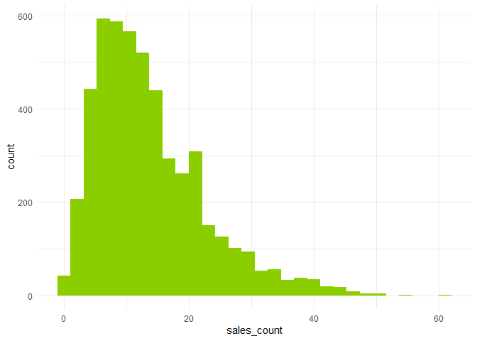
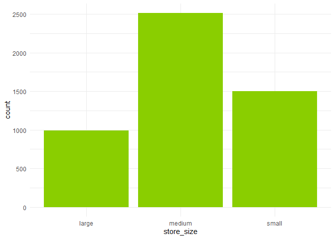
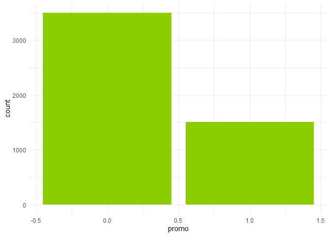
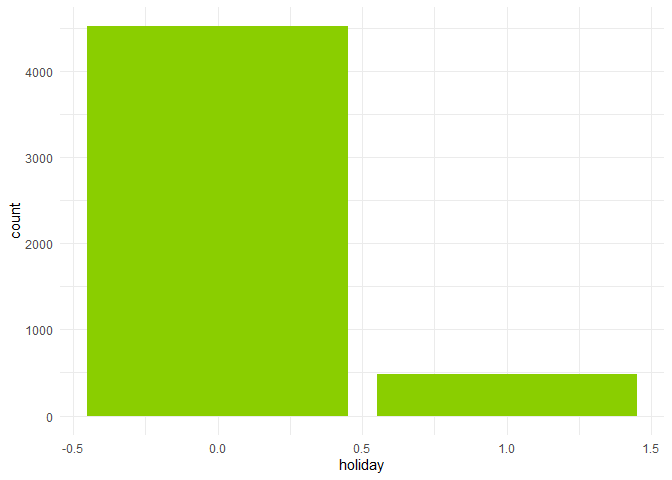

FA5
================
MAYOL, JOSE RAPHAEL J.
2025-05-02

# I. Data Exploration

Run the *store_sales_data.csv* file into a dataset named *df*.

``` r
df <- read.csv("store_sales_data.csv")
head(df)
```

    ##   day_of_week promo holiday store_size sales_count
    ## 1           6     0       0     medium          18
    ## 2           3     0       0     medium          13
    ## 3           4     0       0      large          24
    ## 4           6     1       0      small          16
    ## 5           2     0       0     medium          11
    ## 6           4     0       1     medium          13

Notice the convention used in the *day_of_week* column which is from
0-6. We will assume that 0 means Monday and 6 signifies Sunday. This
will make more sense once we get to the model interpretation sections.

To have a closer look on the dataset, let us run the *summary()*
function.

``` r
summary(df)
```

    ##   day_of_week        promo           holiday        store_size       
    ##  Min.   :0.000   Min.   :0.0000   Min.   :0.0000   Length:5000       
    ##  1st Qu.:1.000   1st Qu.:0.0000   1st Qu.:0.0000   Class :character  
    ##  Median :3.000   Median :0.0000   Median :0.0000   Mode  :character  
    ##  Mean   :2.985   Mean   :0.3012   Mean   :0.0956                     
    ##  3rd Qu.:5.000   3rd Qu.:1.0000   3rd Qu.:0.0000                     
    ##  Max.   :6.000   Max.   :1.0000   Max.   :1.0000                     
    ##   sales_count   
    ##  Min.   : 0.00  
    ##  1st Qu.: 7.00  
    ##  Median :12.00  
    ##  Mean   :13.73  
    ##  3rd Qu.:18.00  
    ##  Max.   :61.00

From the generated summary, the dimensions of the dataset is 5000 rows
and 5 columns. Almost all variables are numerical aside from the
store_size which uses the character data type.

Before we proceed, we must check for null values and address them by
imputing or dropping if needed.

``` r
colSums(is.na(df))
```

    ## day_of_week       promo     holiday  store_size sales_count 
    ##           0           0           0           0           0

Since there are no null values, then we can proceed with exploring the
relationships of the variables.

To enable clean graphs and tables, we will import *tidyverse* and
*kableExtra*.

``` r
library(tidyverse)
```

    ## ── Attaching core tidyverse packages ──────────────────────── tidyverse 2.0.0 ──
    ## ✔ dplyr     1.1.4     ✔ readr     2.1.5
    ## ✔ forcats   1.0.0     ✔ stringr   1.5.1
    ## ✔ ggplot2   3.5.1     ✔ tibble    3.2.1
    ## ✔ lubridate 1.9.4     ✔ tidyr     1.3.1
    ## ✔ purrr     1.0.2     
    ## ── Conflicts ────────────────────────────────────────── tidyverse_conflicts() ──
    ## ✖ dplyr::filter() masks stats::filter()
    ## ✖ dplyr::lag()    masks stats::lag()
    ## ℹ Use the conflicted package (<http://conflicted.r-lib.org/>) to force all conflicts to become errors

``` r
library(kableExtra)
```

    ## 
    ## Attaching package: 'kableExtra'
    ## 
    ## The following object is masked from 'package:dplyr':
    ## 
    ##     group_rows

#### Distribution of sales_count

``` r
ggplot() + 
  geom_histogram(aes(x = sales_count), fill = "#8ACE00", data = df) +
  theme_minimal()
```

    ## `stat_bin()` using `bins = 30`. Pick better value with `binwidth`.

<!-- -->

The histogram shows the distribution of sales_count among the
population. Most data values congregate around the 5 to 15 mark,
signifying that this is where the measures of central tendency lie.
Furthermore, the plot exhibits a right skew which implies the presence
of varying values on the upper ends of the distribution. This is further
supported by the appearance of what seems to be outliers on the very
right side of the graph. However, Poisson regression is a
logarithmic-based process and outliers will not affect the predictive
power of the model significantly.

#### Frequency of each store_size

``` r
ggplot(df, aes(x = store_size)) +
  geom_bar(fill = "#8ACE00") +
  theme_minimal()
```

<!-- -->

The plot shows the frequency distribution of each store_size. Medium
stores lead the population with approximately 2500 (~50%), followed by
small stores at around 1500 (~30%), and finally by large stores
amounting to about 1000 (~20%).

#### Proportion of days with promo

``` r
ggplot(df, aes(x = promo)) +
  geom_bar(fill = "#8ACE00") +
  theme_minimal()
```

<!-- -->

Based on the bar plot above, there are more days without a promo than
there are with one. The proportion is roughly 3500 (~70%) compared to
approximately 1500 (~30%).

#### Proportion of days with holiday

``` r
ggplot(df, aes(x = holiday)) +
  geom_bar(fill = "#8ACE00") +
  theme_minimal()
```

<!-- -->

The plot shows the proportion of days with holidays. Most days are not
holidays, accounting for roughly 4500 (~90%), while the holidays only
amount to around 500 (~10%) of the population.

# II. Model Fitting & Interpretation

We will now fit a Poisson regression model with sales_count as the
outcome and the other remaining variables as predictors.

``` r
poisson_model <- glm(formula = sales_count ~ day_of_week + promo + holiday + store_size, 
             data = df, family = poisson)
```

``` r
summary(poisson_model)
```

    ## 
    ## Call:
    ## glm(formula = sales_count ~ day_of_week + promo + holiday + store_size, 
    ##     family = poisson, data = df)
    ## 
    ## Coefficients:
    ##                   Estimate Std. Error z value Pr(>|z|)    
    ## (Intercept)       2.994849   0.009422  317.86   <2e-16 ***
    ## day_of_week       0.051115   0.001918   26.65   <2e-16 ***
    ## promo             0.410843   0.007817   52.55   <2e-16 ***
    ## holiday          -0.330938   0.014935  -22.16   <2e-16 ***
    ## store_sizemedium -0.697088   0.008296  -84.03   <2e-16 ***
    ## store_sizesmall  -1.395564   0.011868 -117.59   <2e-16 ***
    ## ---
    ## Signif. codes:  0 '***' 0.001 '**' 0.01 '*' 0.05 '.' 0.1 ' ' 1
    ## 
    ## (Dispersion parameter for poisson family taken to be 1)
    ## 
    ##     Null deviance: 25307.2  on 4999  degrees of freedom
    ## Residual deviance:  5142.7  on 4994  degrees of freedom
    ## AIC: 26507
    ## 
    ## Number of Fisher Scoring iterations: 4

Looking at the coefficients, we get the following behaviors in the
model:

- The expected sales count for a store **increases by** a factor of
  $e^{0.051115}\approx1.05244$ or **5.244% for every day of the week
  after Monday**. This implies that Sunday should be the most profitable
  day in a sales week. In real life, weekends do tend to have higher
  sales turnouts, proving that our naming convention for *day_of_week*
  in Section I to be grounded in reality.

- When there is a promo day, the expected sales for a store **increases
  by** a factor of $e^{0.410843}\approx1.50809$ or **50.809%**. Hence,
  promo days are really effective for bringing in more profit.

- Holidays should be major profit-diving opportunities for stores, but
  this is not the case for the stores in the dataset. Based on the
  model, **sales days which celebrate holidays have lower sales counts**
  by a factor of $e^{-0.330938}\approx0.71825$, effectively implying
  that days with holidays are only **71.825% as effective as days
  without one**.

- From the coefficients of the model, sales count **increases as the
  store size gets bigger**. **Medium** stores only get
  $e^{-0.697088}\approx0.498033$ or **49.8033% of the sales counts** of
  large stores while **small** stores yield an even lower
  $e^{-1.395564}\approx0.247693$ or **24.7693%**.

# III. Model Diagnostics

To check whether the model is effective, we must check if it satisfies
the assumption of $E[X]=\lambda$ or equal mean and variances. This can
be done by computing for the overdispersion value of the model which
should more or less equal 1.

``` r
overdispersion_tb <- data.frame(
  Statistic = c("Overdispersion"),
  Value = c(deviance(poisson_model)/df.residual(poisson_model))
)
kable(overdispersion_tb)
```

| Statistic      |    Value |
|:---------------|---------:|
| Overdispersion | 1.029785 |

The table shows that the model has an **overdispersion** value of only
**1.029785** which is really close to 1. This means that **the Poisson
assumption of equal mean and variance** **holds** for this model.
However, it must still be known whether this 2.9785% of overdispersion
is significant enough for this dataset. Hence, we can try fitting it
into a quasi-Poisson model for comparison.

``` r
qp_model <- glm(formula = sales_count ~ day_of_week + promo + holiday + store_size, 
             data = df, family = quasipoisson)
summary(qp_model)
```

    ## 
    ## Call:
    ## glm(formula = sales_count ~ day_of_week + promo + holiday + store_size, 
    ##     family = quasipoisson, data = df)
    ## 
    ## Coefficients:
    ##                   Estimate Std. Error t value Pr(>|t|)    
    ## (Intercept)       2.994849   0.009475  316.07   <2e-16 ***
    ## day_of_week       0.051115   0.001929   26.50   <2e-16 ***
    ## promo             0.410843   0.007862   52.26   <2e-16 ***
    ## holiday          -0.330938   0.015020  -22.03   <2e-16 ***
    ## store_sizemedium -0.697088   0.008343  -83.56   <2e-16 ***
    ## store_sizesmall  -1.395564   0.011936 -116.92   <2e-16 ***
    ## ---
    ## Signif. codes:  0 '***' 0.001 '**' 0.01 '*' 0.05 '.' 0.1 ' ' 1
    ## 
    ## (Dispersion parameter for quasipoisson family taken to be 1.011374)
    ## 
    ##     Null deviance: 25307.2  on 4999  degrees of freedom
    ## Residual deviance:  5142.7  on 4994  degrees of freedom
    ## AIC: NA
    ## 
    ## Number of Fisher Scoring iterations: 4

``` r
overdispersion_tb1 <- data.frame(
  Model = c("Poisson","Quasi-Poisson"),
  Value = c(deviance(poisson_model)/df.residual(poisson_model),deviance(qp_model)/df.residual(qp_model))
)
kable(overdispersion_tb1)
```

| Model         |    Value |
|:--------------|---------:|
| Poisson       | 1.029785 |
| Quasi-Poisson | 1.029785 |

Since the overdispersion values are exactly the same, then there is
indeed **no overdispersion in the original Poisson regression model**.

# IV. Predictions & Explanation

- **Predict expected sales for a medium store on a Monday with a
  promotion and no holiday.**

``` r
predict.glm(poisson_model, data.frame(day_of_week=0,promo=1,holiday=0,store_size="medium"), type="response")
```

    ##        1 
    ## 15.00832

The expected sales for a medium store on a Monday with a promotion and
no holiday is **15**.

- **Predict sales for a large store on a Sunday with no promotion and a
  holiday.**

``` r
predict.glm(poisson_model, data.frame(day_of_week=6,promo=0,holiday=1,store_size="large"), type="response")
```

    ##        1 
    ## 19.50371

The expected sales for a large store on a Sunday with no promotion but
with a holiday is effectively **19**.

# V. Reflection

A Poisson regression was conducted to predict the sales count of a
specific store on a single day based on the day of the week, the
presence of a promo or a holiday, and the store size. Among these
factors, store size proved to be most influential, followed by promo,
then holiday, and finally by day of the week. While the latter may seem
like an inconsequential predictor at first, weekends actually become
very significant coefficients in the equation for sales counts.
Generally, its low overdispersion implies that the model is a good way
to gauge a store’s expected sales counts. However, the real-life market
is ever-changing; and with new policies or sudden socioeconomic changes,
consumer behavior will change drastically. Visibly during the lockdown,
there are only certain days where citizens can reliably shop for goods.
Furthermore, weekends did not translate to higher sales turnouts.
