Summative Assessment 1
================
MAYOL, JOSE RAPHAEL J.
2025-03-19

## **Dataset: EDA_Ecommerce_Assessment.csv**

**Dataset Description:** The dataset contains information about customer
purchasing behavior in an e-commerce platform. The variables include:

- `Customer_ID`: Unique identifier for each customer

- `Gender`: Male or Female

- `Age`: Customer’s age in years

- `Browsing_Time`: Average time spent on the website per visit (in
  minutes)

- `Purchase_Amount`: Total amount spent in a single transaction (in USD)

- `Number_of_Items`: Number of items purchased per transaction

- `Discount_Applied`: Discount percentage applied to the transaction

- `Total_Transactions`: Total number of transactions by the customer

- `Category`: Product category (e.g., Electronics, Clothing, Home &
  Kitchen, etc.)

- `Satisfaction_Score`: Customer satisfaction score (1-5 scale)

## **Assessment Tasks**

# **Unit 1: Univariate Data Analysis**

## 1. Load the dataset and summarize its structure.

**Solution.**

``` r
data <- read.csv("EDA_Ecommerce_Assessment.csv")
head(data)
```

    ##   Customer_ID Gender Age Browsing_Time Purchase_Amount Number_of_Items
    ## 1           1   Male  65         46.55          231.81               6
    ## 2           2 Female  19         98.80          472.78               8
    ## 3           3   Male  23         79.48          338.44               1
    ## 4           4   Male  45         95.75           37.13               7
    ## 5           5   Male  46         33.36          235.53               3
    ## 6           6 Female  43         83.39          123.92               9
    ##   Discount_Applied Total_Transactions       Category Satisfaction_Score
    ## 1               17                 16       Clothing                  2
    ## 2               15                 43          Books                  4
    ## 3               28                 31    Electronics                  1
    ## 4               43                 27 Home & Kitchen                  5
    ## 5               10                 33          Books                  3
    ## 6                5                 29       Clothing                  2

``` r
summary(data)
```

    ##   Customer_ID        Gender               Age        Browsing_Time   
    ##  Min.   :   1.0   Length:3000        Min.   :18.00   Min.   :  1.00  
    ##  1st Qu.: 750.8   Class :character   1st Qu.:31.00   1st Qu.: 29.98  
    ##  Median :1500.5   Mode  :character   Median :44.00   Median : 59.16  
    ##  Mean   :1500.5                      Mean   :43.61   Mean   : 59.87  
    ##  3rd Qu.:2250.2                      3rd Qu.:57.00   3rd Qu.: 89.33  
    ##  Max.   :3000.0                      Max.   :69.00   Max.   :119.95  
    ##  Purchase_Amount  Number_of_Items Discount_Applied Total_Transactions
    ##  Min.   :  5.03   Min.   :1.00    Min.   : 0.00    Min.   : 1.00     
    ##  1st Qu.:128.69   1st Qu.:3.00    1st Qu.:12.00    1st Qu.:12.00     
    ##  Median :245.09   Median :5.00    Median :24.00    Median :24.00     
    ##  Mean   :247.96   Mean   :4.99    Mean   :24.34    Mean   :24.68     
    ##  3rd Qu.:367.20   3rd Qu.:7.00    3rd Qu.:37.00    3rd Qu.:37.00     
    ##  Max.   :499.61   Max.   :9.00    Max.   :49.00    Max.   :49.00     
    ##    Category         Satisfaction_Score
    ##  Length:3000        Min.   :1.000     
    ##  Class :character   1st Qu.:2.000     
    ##  Mode  :character   Median :3.000     
    ##                     Mean   :3.066     
    ##                     3rd Qu.:4.000     
    ##                     Max.   :5.000

**The dataset consists of 3000 entries and 10 columns, having both
nominal and ordinal variables.**

## 2. Create histograms and boxplots to visualize the distribution of `Purchase_Amount`, `Number_of_Items`, and `Satisfaction_Score`.

**Solution.**

``` r
purchase_histo <- ggplot(data, aes(x = Purchase_Amount)) +
  geom_histogram(binwidth = 10, fill = "pink", color = "black", alpha = 0.7) +
  labs(title = "Histogram of Purchase Amount",
       x = "Purchase Amount",
       y = "Frequency") +
  theme_minimal()
purchase_boxplot <- ggplot(data, aes(x = "", y = Purchase_Amount)) +
  geom_boxplot(fill = "pink", color = "black", alpha = 0.7) +
  labs(title = "Boxplot of Purchase Amount",
       x = "",
       y = "Purchase Amount") +
  theme_minimal()
purchase_plots <- plot_grid(purchase_histo, purchase_boxplot, labels = c("A", "B"), ncol = 2, align = "h")
purchase_plots
```

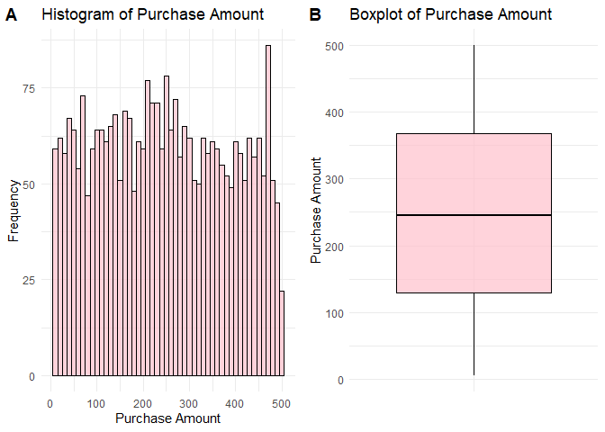<!-- -->

``` r
num_items_histo <- ggplot(data, aes(x = Number_of_Items)) +
  geom_bar(fill = "pink", color = "black", alpha = 0.7) +
  labs(title = "Histogram of Number of Items",
       x = "Number of Items",
       y = "Frequency") +
  theme_minimal()
num_items_boxplot <- ggplot(data, aes(x = "", y = Number_of_Items)) +
  geom_boxplot(fill = "pink", color = "black", alpha = 0.7) +
  labs(title = "Boxplot of Number of Items",
       x = "",
       y = "Number of Items") +
  theme_minimal()
num_items_plots <- plot_grid(num_items_histo, num_items_boxplot, labels = c("A", "B"), ncol = 2, align = "h")
num_items_plots
```

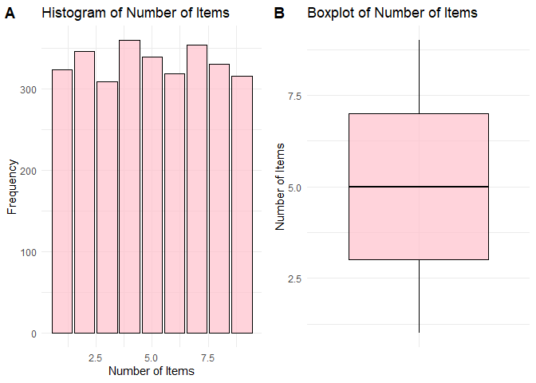<!-- -->

**Since *Number_of_Items* is a discrete variable, *geom_bar* was used
instead of *geom_histogram*.**

``` r
satisfaction_histo <- ggplot(data, aes(x = Satisfaction_Score)) +
  geom_bar(fill = "pink", color = "black", alpha = 0.7) +
  labs(title = "Histogram of Satisfaction Score",
       x = "Satisfaction Score",
       y = "Frequency") +
  theme_minimal()
satisfaction_boxplot <- ggplot(data, aes(x = "", y = Satisfaction_Score)) +
  geom_boxplot(fill = "pink", color = "black", alpha = 0.7) +
  labs(title = "Boxplot of Satisfaction Score",
       x = "",
       y = "Satisfaction Score") +
  theme_minimal()
satisfaction_plots <- plot_grid(satisfaction_histo, satisfaction_boxplot, labels = c("A", "B"), ncol = 2, align = "h")
satisfaction_plots
```

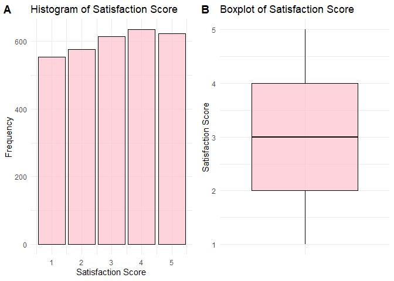<!-- -->

**Just like with** ***Number_of_Items*, *geom_bar* was used for
*Satisfaction_Score* instead of *geom_histogram* since it consists of
discrete values.**

**One notable thing to notice about the boxplots is that none of the
investigated columns have any outliers. This implies that no extreme
values will skew the results of any further investigation.**

## 3. Compute measures of central tendency (mean, median, mode) and spread (variance, standard deviation, IQR) for `Purchase_Amount`.

**Solution.**

``` r
library(flextable)
```

    ## Warning: package 'flextable' was built under R version 4.4.3

    ## 
    ## Attaching package: 'flextable'

    ## The following object is masked from 'package:purrr':
    ## 
    ##     compose

``` r
mean_purchase <- mean(data$Purchase_Amount, na.rm = TRUE)
median_purchase <- median(data$Purchase_Amount, na.rm = TRUE)
mode_purchase <- as.numeric(names(sort(table(data$Purchase_Amount), decreasing = TRUE)[1]))
variance_purchase <- var(data$Purchase_Amount, na.rm = TRUE)
sd_purchase <- sd(data$Purchase_Amount, na.rm = TRUE)
iqr_purchase <- IQR(data$Purchase_Amount, na.rm = TRUE)

central_spread_purchase <- data.frame(
  Statistic = c("Mean", "Median", "Mode", "Variance", "Standard Deviation", "IQR"),
  Value = c(mean_purchase, median_purchase, mode_purchase, variance_purchase, sd_purchase, iqr_purchase)
)

central_spread_purchase %>%
  flextable() %>%
  set_caption("Table 1: Summary Statistics for Purchase Amount")
```

<!-- -->

**The table shows the measures of central tendencies and spread of
*Purchase_Amount*.**

## 4. Compare the distribution of `Browsing_Time` and `Purchase_Amount` across different `Gender` groups using density plots.

**Solution.**

``` r
browsing_time_density <- ggplot(data, aes(x = Browsing_Time, fill = Gender)) +
  geom_density(alpha = 0.5) +
  labs(title = "Browsing Time by Gender",
       x = "Browsing Time",
       y = "Density") +
  theme_minimal()

purchase_density <- ggplot(data, aes(x = Purchase_Amount, fill = Gender)) +
  geom_density(alpha = 0.5) +
  labs(title = "Purchase Amount by Gender",
       x = "Purchase Amount",
       y = "Density") +
  theme_minimal()

density_plots <- plot_grid(browsing_time_density, purchase_density, labels = c("A", "B"), ncol = 2, align = "h")

density_plots
```

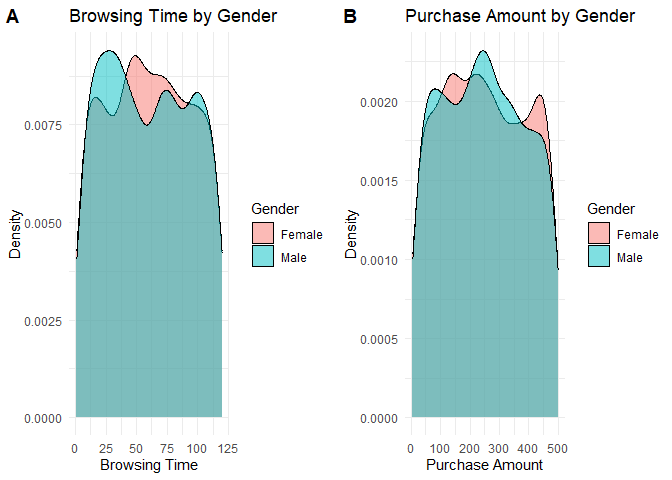<!-- -->

**For Browsing Time, the female group approaches a symmetric
distribution with a small peak on the left, while the male group has a
right skew with two small peaks on the right. In the Purchase Amount
density plots, the male group has a more symmetric distribution with a
small peak on the left. This time, the female group has two peaks, both
of which lie on relatively opposite sides of the graph.**

## 5. Apply a logarithmic or square root transformation on `Browsing_Time` and evaluate changes in skewness.

**Solution.**

``` r
data$log_Browsing_Time <- log(data$Browsing_Time)

log_browsing_time_density <- ggplot(data, aes(x = log_Browsing_Time, fill = Gender)) +
  geom_density(alpha = 0.5) +
  labs(title = "Log-Transformed Browsing Time by Gender",
       x = "Log-Transformed Browsing Time",
       y = "Density") +
  theme_minimal()

log_browsing_time_density
```

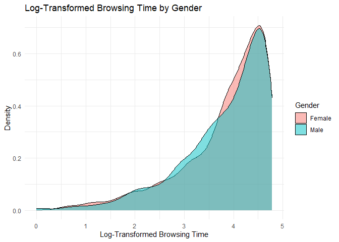<!-- -->

**After log-transforming, the density plots of *Browsing_Time* for both
female and male groups now have a prominent left skew. Let us see what
happens when we do a square root transformation instead.**

``` r
data$sqrt_Browsing_Time <- sqrt(data$Browsing_Time)

sqrt_browsing_time_density <- ggplot(data, aes(x = sqrt_Browsing_Time, fill = Gender)) +
  geom_density(alpha = 0.5) +
  labs(title = "Sqrt-Transformed Browsing Time by Gender",
       x = "Sqrt-Transformed Browsing Time",
       y = "Density") +
  theme_minimal()

sqrt_browsing_time_density
```

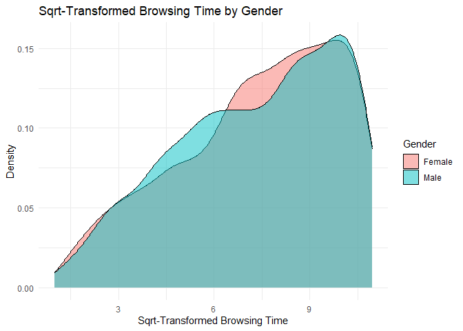<!-- -->

**Square-root transformation of *Browsing_Time* yielded density plots
that were ‘thicker’ than that of the logarithm. As shown in the graph,
both groups also have a left skew, though not as pronounced as the
log-transformed data.**

## 6. Fit a simple linear regression model predicting `Purchase_Amount` based on `Browsing_Time`. Interpret the results.

**Solution.**

``` r
purchase_browsing_fx <- lm(Purchase_Amount ~ Browsing_Time, data = data)
purchase_browsing_fx
```

    ## 
    ## Call:
    ## lm(formula = Purchase_Amount ~ Browsing_Time, data = data)
    ## 
    ## Coefficients:
    ##   (Intercept)  Browsing_Time  
    ##     252.65596       -0.07839

**As the slope is negative, purchase amount decreases as browsing time
increases. This inverse relationship may suggest that customers become
more dissuaded to purchase as they spend more time browsing and not
giving into impulse.**

## 7. Use `ggplot2` (or equivalent) to create scatter plots and regression lines.

**Solution.**

``` r
purchase_browsing_line <- ggplot(data, aes(x = Browsing_Time, y = Purchase_Amount)) +
  geom_point(color = "blue", alpha = 0.6) +
  geom_smooth(method = "lm", color = "red", se = TRUE) +  
  labs(title = "Purchase Amount vs Browsing Time",
       x = "Browsing Time",
       y = "Purchase Amount") +
  theme_minimal()
purchase_browsing_line
```

    ## `geom_smooth()` using formula = 'y ~ x'

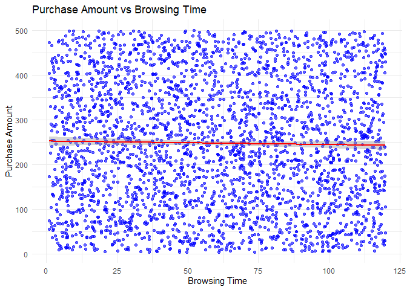<!-- -->

**Note that the y-axis has been compressed to fit the graph better on
the screen. As suggested by the line of fit (in red), purchase_amount
decreases as browsing time increases.**

# **Unit 2: Bivariate Data Analysis**

## 8. Create scatter plots to explore the relationship between `Purchase_Amount` and `Number_of_Items`.

**Solution.**

``` r
purchase_items_line <- ggplot(data, aes(x = Number_of_Items, y = Purchase_Amount)) +
  geom_point(color = "blue", alpha = 0.6) +
  labs(title = "Purchase Amount vs Number of Items",
       x = "Number of Items",
       y = "Purchase Amount") +
  theme_minimal()
purchase_items_line
```

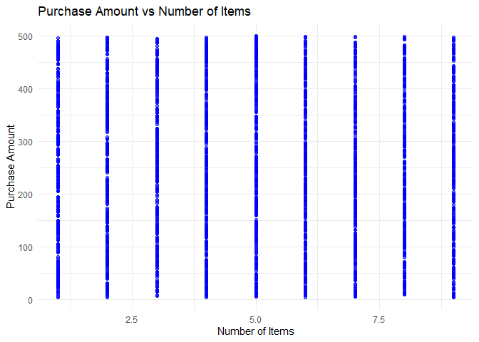<!-- -->

**Judging by the scatterplot, there seems to be no relationship between
the two variables. Hence, it is suggested that the number of items
bought has no implication on the total price of an order.**

## 9. Fit a polynomial regression model for `Purchase_Amount` and `Browsing_Time` and compare it with a simple linear model.

**Solution.**

**First, we will have to find an optimal degree for the polynomial
regression model using an ANOVA test.**

``` r
fit_2 <- lm(Purchase_Amount ~ poly(Browsing_Time, 2), data = data)
fit_3 <- lm(Purchase_Amount ~ poly(Browsing_Time, 3), data = data)
fit_4 <- lm(Purchase_Amount ~ poly(Browsing_Time, 4), data = data)
fit_5 <- lm(Purchase_Amount ~ poly(Browsing_Time, 5), data = data)
anova(purchase_browsing_fx, fit_2,fit_3,fit_4,fit_5)
```

    ## Analysis of Variance Table
    ## 
    ## Model 1: Purchase_Amount ~ Browsing_Time
    ## Model 2: Purchase_Amount ~ poly(Browsing_Time, 2)
    ## Model 3: Purchase_Amount ~ poly(Browsing_Time, 3)
    ## Model 4: Purchase_Amount ~ poly(Browsing_Time, 4)
    ## Model 5: Purchase_Amount ~ poly(Browsing_Time, 5)
    ##   Res.Df      RSS Df Sum of Sq      F Pr(>F)
    ## 1   2998 59496437                           
    ## 2   2997 59491795  1      4642 0.2338 0.6287
    ## 3   2996 59447052  1     44744 2.2540 0.1334
    ## 4   2995 59447049  1         3 0.0002 0.9901
    ## 5   2994 59434444  1     12604 0.6349 0.4256

**None of the p values are less than 0.05. Hence, there is no point in
choosing a higher number and we could just use a degree of 2.**

``` r
purchase_browsing_line2 <- ggplot(data, aes(x = Browsing_Time, y = Purchase_Amount)) +
  geom_point(color = "blue", alpha = 0.6) +
  geom_smooth(method = "lm", color = "red", se = TRUE) +
  geom_smooth(method = "lm", formula = y ~ poly(x, 2), color = "green", se = TRUE) +
  labs(title = "Comparison of Linear and Polynomial Regression",
       x = "Browsing Time",
       y = "Purchase Amount",
       caption = "Red = Linear | Green = Quadratic") +
  theme_minimal()
purchase_browsing_line2
```

    ## `geom_smooth()` using formula = 'y ~ x'

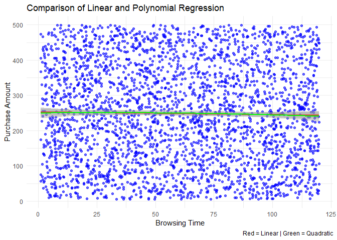<!-- -->

**The values for both linear and polynomial regression models are
visually close. Since the p-values for both models are also below 0.05
as shown earlier, then none of these are functional.**

## 10. Apply LOESS (Locally Estimated Scatterplot Smoothing) to `Purchase_Amount` vs. `Browsing_Time` and visualize the results.

**Solution.**

``` r
purchase_browsing_loess <- ggplot(data, aes(x = Browsing_Time, y = Purchase_Amount)) +
  geom_point(color = "blue", alpha = 0.6) +
  geom_smooth(method = "loess", color = "red", se = TRUE)
  labs(title = "LOESS Model for Purchase Amount vs Browsing Time",
       x = "Browsing Time",
       y = "Purchase Amount") +
  theme_minimal()
```

    ## NULL

``` r
purchase_browsing_loess
```

    ## `geom_smooth()` using formula = 'y ~ x'

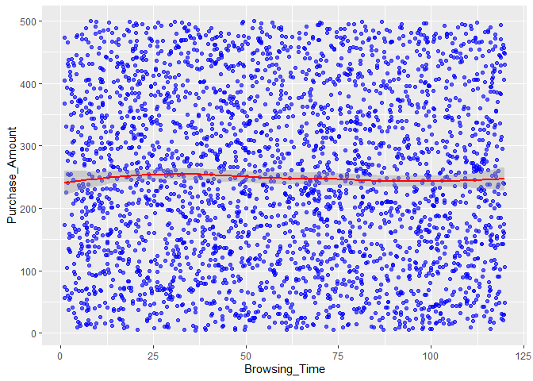<!-- -->

**The LOESS curve is not a straight line but is close to the earlier
simple regression line. This suggests that the true relationship of
*Purchase_Amount* and *Browsing_Time* can be expressed linearly.**

## 11. Compare robust regression methods (Huber or Tukey regression) with ordinary least squares (OLS).

**Solution.**

``` r
library(MASS)
```

    ## 
    ## Attaching package: 'MASS'

    ## The following object is masked from 'package:dplyr':
    ## 
    ##     select

``` r
huber_model <- rlm(Purchase_Amount ~ Browsing_Time, data = data, psi = psi.huber)
ols_model <- lm(Purchase_Amount ~ Browsing_Time, data = data)
tukey_model <- rlm(Purchase_Amount ~ Browsing_Time, data = data, psi = psi.bisquare)

data$huber_pred <- predict(huber_model)
data$ols_pred <- predict(ols_model)
data$tukey_pred <- predict(tukey_model)

huber_vs_ols_vs_tukey <- ggplot(data, aes(x = Browsing_Time, y = Purchase_Amount)) +
  geom_point(color = "blue", alpha = 0.6) +
  geom_line(aes(y = ols_pred), color = "green", linewidth = 1) +
  geom_line(aes(y = huber_pred), color = "red", linewidth = 1, linetype = "dashed") +
  geom_line(aes(y = tukey_pred), color = "black", size = 1, linetype = "dotted") +
  labs(title = "Purchase Amount vs Browsing Time: OLS vs. Huber vs. Tukey Regression",
       x = "Browsing Time",
       y = "Purchase Amount",
       caption = "Green = OLS | Red = Huber (dashed) | Black = Tukey (dotted)") +
  theme_minimal()
```

    ## Warning: Using `size` aesthetic for lines was deprecated in ggplot2 3.4.0.
    ## ℹ Please use `linewidth` instead.
    ## This warning is displayed once every 8 hours.
    ## Call `lifecycle::last_lifecycle_warnings()` to see where this warning was
    ## generated.

``` r
huber_vs_ols_vs_tukey
```

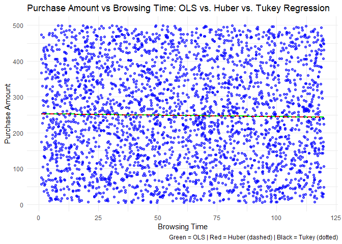<!-- -->

**All three of the regression models follow very similar paths. Hence,
there seems to be no significant difference between the three in terms
of representing the relationship between *Purchase_Amount* and
*Browsing_Time*. Let us try comparing the actual equations themselves.**

``` r
summary(huber_model)
```

    ## 
    ## Call: rlm(formula = Purchase_Amount ~ Browsing_Time, data = data, psi = psi.huber)
    ## Residuals:
    ##      Min       1Q   Median       3Q      Max 
    ## -244.818 -120.331   -2.848  118.291  254.289 
    ## 
    ## Coefficients:
    ##               Value    Std. Error t value 
    ## (Intercept)   252.6462   5.3363    47.3448
    ## Browsing_Time  -0.0803   0.0773    -1.0378
    ## 
    ## Residual standard error: 176.9 on 2998 degrees of freedom

``` r
summary(tukey_model)
```

    ## 
    ## Call: rlm(formula = Purchase_Amount ~ Browsing_Time, data = data, psi = psi.bisquare)
    ## Residuals:
    ##      Min       1Q   Median       3Q      Max 
    ## -244.823 -119.866   -2.644  118.511  255.023 
    ## 
    ## Coefficients:
    ##               Value    Std. Error t value 
    ## (Intercept)   252.8187   5.5699    45.3899
    ## Browsing_Time  -0.0883   0.0807    -1.0942
    ## 
    ## Residual standard error: 176.8 on 2998 degrees of freedom

``` r
summary(ols_model)
```

    ## 
    ## Call:
    ## lm(formula = Purchase_Amount ~ Browsing_Time, data = data)
    ## 
    ## Residuals:
    ##      Min       1Q   Median       3Q      Max 
    ## -244.867 -120.473   -2.946  118.246  254.069 
    ## 
    ## Coefficients:
    ##                Estimate Std. Error t value Pr(>|t|)    
    ## (Intercept)   252.65596    5.17524  48.820   <2e-16 ***
    ## Browsing_Time  -0.07839    0.07501  -1.045    0.296    
    ## ---
    ## Signif. codes:  0 '***' 0.001 '**' 0.01 '*' 0.05 '.' 0.1 ' ' 1
    ## 
    ## Residual standard error: 140.9 on 2998 degrees of freedom
    ## Multiple R-squared:  0.0003642,  Adjusted R-squared:  3.075e-05 
    ## F-statistic: 1.092 on 1 and 2998 DF,  p-value: 0.2961

**As expected, the equations for the three regression models are
extremely close with one another. This is in line with the findings in
our earlier boxplots that there are no outliers in the dataset.
Furthermore, the data could follow a normal distribution since the
regression lines for Huber and Tukey are almost exactly the same as OLS,
which assumes normally-distributed data. This is also congruent with the
finding from the LOESS, suggesting that a linear fit is sufficient for
the data.**

# **Unit 3: Trivariate/Hypervariate Data Analysis**

## 12. Explore interaction effects between `Browsing_Time` and `Category` on `Purchase_Amount` using interaction plots.

**Solution.**

``` r
interaction.plot(x.factor = data$Browsing_Time,
                 trace.factor = data$Category,
                 response = data$Purchase_Amount,
                 fun = mean,
                 col = rainbow(length(unique(data$Category))),
                 lty = 1,
                 xlab = "Browsing Time",
                 ylab = "Purchase Amount",
                 main = "Interaction Plot: Browsing Time & Category on Purchase Amount")
```

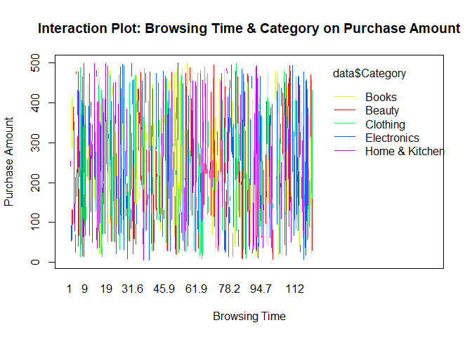<!-- -->

**The interaction plot is cluttered and hard to read. Let us try
applying LOESS smoothing to**

``` r
ggplot(data, aes(x = Browsing_Time, y = Purchase_Amount, color = Category)) +
  geom_smooth(method = "loess", se = FALSE) +
  labs(title = "LOESS Interaction Plot: Browsing Time & Category",
       x = "Browsing Time",
       y = "Purchase Amount",
       color = "Category") +
  theme_minimal()
```

    ## `geom_smooth()` using formula = 'y ~ x'

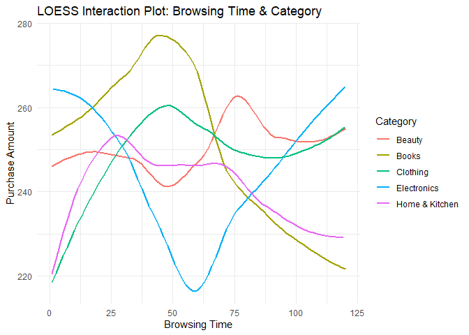<!-- -->

**Each category follow a different trend. For instance, Books rises then
drops while Electronics is in reverse. Since the lines cross, this
suggests that the effect of *Browsing_Time* on *Purchase_Amount* differs
depending on the *Category*. Also, since the different curves have
varying peaks and dips, then our previous interpretations of the
relationship between *Purchase_Amount* and *Browsing_Time* being
sufficiently described as linear may hold less validity now.**

## 13. Create coplots of `Purchase_Amount` against `Browsing_Time` for different levels of `Category`.

**Solution.**

``` r
ggplot(data, aes(x = Browsing_Time, y = Purchase_Amount)) +
  geom_point(alpha = 0.5, color = "blue") +
  geom_smooth(method = "loess", se = FALSE, color = "red") +  
  facet_wrap(~Category) +
  labs(title = "Purchase Amount vs Browsing Time by Category",
       x = "Browsing Time",
       y = "Purchase Amount") +
  theme_minimal()
```

    ## `geom_smooth()` using formula = 'y ~ x'

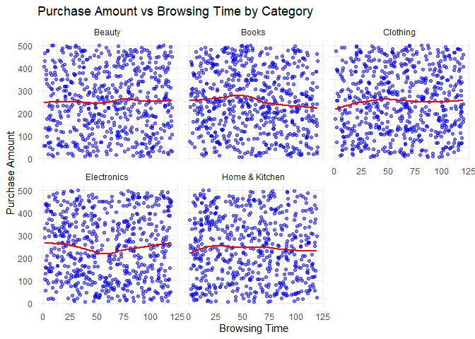<!-- -->

**From the coplots, we can see that *Browsing_Time* has a direct
relationship with *Purchase_Amount* under the Beauty and Clothing
categories. The opposite can be said about the Books and Home & Kitchen
categories, which seemingly exhibit an inverse relationship. Unlike all
the others, a slight parabolic relationship can be made from the
Electronics category.**

## 14. Use level plots or contour plots to visualize relationships between `Browsing_Time`, `Number_of_Items`, and `Purchase_Amount`.

**Solution.**

``` r
ggplot(data, aes(x = Browsing_Time, y = Number_of_Items, fill = Purchase_Amount)) +
  geom_tile() + 
  scale_fill_viridis_c() +
  labs(title = "Level Plot: Browsing Time vs Number of Items",
       x = "Browsing Time",
       y = "Number of Items",
       fill = "Purchase Amount") +
  theme_minimal()
```

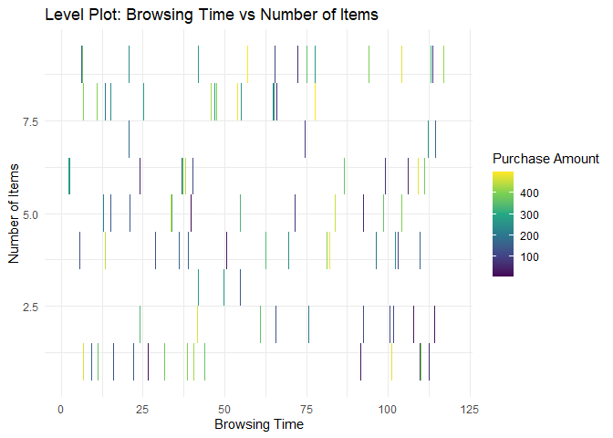<!-- -->

**The data is too sparse to make a proper level plot. We need to fill in
the gaps by binning *Browsing_Time* and *Number_of_Items*.**

``` r
data_binned <- data %>%
  mutate(
    Browsing_Time_bin = cut(Browsing_Time, breaks = 10), 
    Number_of_Items_bin = cut(Number_of_Items, breaks = 5)
  ) %>%
  group_by(Browsing_Time_bin, Number_of_Items_bin) %>%
  summarize(Purchase_Amount = mean(Purchase_Amount, na.rm = TRUE), .groups = "drop")

ggplot(data_binned, aes(x = Browsing_Time_bin, y = Number_of_Items_bin, fill = Purchase_Amount)) +
  geom_tile() +  
  scale_fill_viridis_c() +
  labs(title = "Binned Level Plot: Browsing Time vs Number of Items",
       x = "Browsing Time (Binned)", y = "Number of Items (Binned)",
       fill = "Purchase Amount") +
  theme_minimal()
```

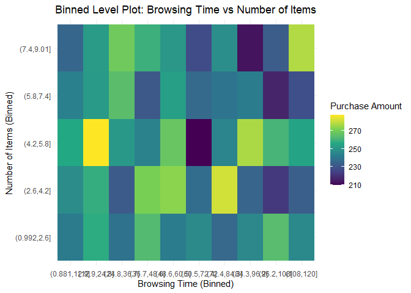<!-- -->

**At first glance, there seems to be no apparent trend in the data.
However, we can see that darker boxes appear frequently when more items
are purchased. The inverse can be said about lower bought items, where
dark boxes appear less or don’t even appear at all. This seems to
suggest that *Purchase_Amount* increases with *Number_of_Items*
sometimes, but not always. Another variable has the same trend** —
**more dark boxes appear when *Browsing_Time* is higher and vice versa,
but also not always. Hence, both *Number_of_Items and Browsing_Time*
influence the *Purchase_Amount*** **but not in a completely linear
manner.**

## 15. Perform multiple regression with `Purchase_Amount` as the dependent variable and `Browsing_Time`, `Number_of_Items`, and `Satisfaction_Score` as predictors. Perform model selection and assess variable importance.

**Solution.**

``` r
multiple_model <- lm(Purchase_Amount ~ Browsing_Time + Number_of_Items + Satisfaction_Score, data = data)
summary(multiple_model)
```

    ## 
    ## Call:
    ## lm(formula = Purchase_Amount ~ Browsing_Time + Number_of_Items + 
    ##     Satisfaction_Score, data = data)
    ## 
    ## Residuals:
    ##      Min       1Q   Median       3Q      Max 
    ## -250.668 -120.856   -2.846  118.899  255.664 
    ## 
    ## Coefficients:
    ##                     Estimate Std. Error t value Pr(>|t|)    
    ## (Intercept)        261.34993    9.24929  28.256   <2e-16 ***
    ## Browsing_Time       -0.07954    0.07504  -1.060    0.289    
    ## Number_of_Items     -0.78321    1.00497  -0.779    0.436    
    ## Satisfaction_Score  -1.53871    1.83444  -0.839    0.402    
    ## ---
    ## Signif. codes:  0 '***' 0.001 '**' 0.01 '*' 0.05 '.' 0.1 ' ' 1
    ## 
    ## Residual standard error: 140.9 on 2996 degrees of freedom
    ## Multiple R-squared:  0.0007932,  Adjusted R-squared:  -0.0002073 
    ## F-statistic: 0.7928 on 3 and 2996 DF,  p-value: 0.4978

**The p-values for *Browsing_Time*, *Number_of_Items*, and
*Satisfaction_Score* are all above 0.05. This means that there are no
significant relationships with any of the variables. The low R-squared
and F-statistic further corroborate this point. Thus, *Browsing_Time*,
*Number_of_Items*, and *Satisfaction_Score* do not predict
*Purchase_Amount* in any statistically sound way.**

``` r
stepwise_model <- stepAIC(multiple_model, direction = "both")
```

    ## Start:  AIC=29691.89
    ## Purchase_Amount ~ Browsing_Time + Number_of_Items + Satisfaction_Score
    ## 
    ##                      Df Sum of Sq      RSS   AIC
    ## - Number_of_Items     1     12056 59482958 29691
    ## - Satisfaction_Score  1     13966 59484867 29691
    ## - Browsing_Time       1     22299 59493201 29691
    ## <none>                            59470902 29692
    ## 
    ## Step:  AIC=29690.5
    ## Purchase_Amount ~ Browsing_Time + Satisfaction_Score
    ## 
    ##                      Df Sum of Sq      RSS   AIC
    ## - Satisfaction_Score  1     13479 59496437 29689
    ## - Browsing_Time       1     21541 59504498 29690
    ## <none>                            59482958 29691
    ## + Number_of_Items     1     12056 59470902 29692
    ## 
    ## Step:  AIC=29689.18
    ## Purchase_Amount ~ Browsing_Time
    ## 
    ##                      Df Sum of Sq      RSS   AIC
    ## - Browsing_Time       1     21676 59518113 29688
    ## <none>                            59496437 29689
    ## + Satisfaction_Score  1     13479 59482958 29691
    ## + Number_of_Items     1     11569 59484867 29691
    ## 
    ## Step:  AIC=29688.27
    ## Purchase_Amount ~ 1
    ## 
    ##                      Df Sum of Sq      RSS   AIC
    ## <none>                            59518113 29688
    ## + Browsing_Time       1     21676 59496437 29689
    ## + Satisfaction_Score  1     13614 59504498 29690
    ## + Number_of_Items     1     10822 59507290 29690

``` r
summary(stepwise_model)
```

    ## 
    ## Call:
    ## lm(formula = Purchase_Amount ~ 1, data = data)
    ## 
    ## Residuals:
    ##      Min       1Q   Median       3Q      Max 
    ## -242.933 -119.268   -2.873  119.237  251.647 
    ## 
    ## Coefficients:
    ##             Estimate Std. Error t value Pr(>|t|)    
    ## (Intercept)  247.963      2.572   96.41   <2e-16 ***
    ## ---
    ## Signif. codes:  0 '***' 0.001 '**' 0.01 '*' 0.05 '.' 0.1 ' ' 1
    ## 
    ## Residual standard error: 140.9 on 2999 degrees of freedom

**As expected, adding predictors does not improve model performance
significantly. Leaving *Browsing_Time* as the sole predictor, while
having the lowest AIC among the three, is still not giving satisfactory
prediction performance. These findings are consistent with the low
R-squared value from before.**

``` r
library(relaimpo)
```

    ## Warning: package 'relaimpo' was built under R version 4.4.3

    ## Loading required package: boot

    ## Loading required package: survey

    ## Warning: package 'survey' was built under R version 4.4.3

    ## Loading required package: grid

    ## Loading required package: Matrix

    ## 
    ## Attaching package: 'Matrix'

    ## The following objects are masked from 'package:tidyr':
    ## 
    ##     expand, pack, unpack

    ## Loading required package: survival

    ## 
    ## Attaching package: 'survival'

    ## The following object is masked from 'package:boot':
    ## 
    ##     aml

    ## 
    ## Attaching package: 'survey'

    ## The following object is masked from 'package:graphics':
    ## 
    ##     dotchart

    ## Loading required package: mitools

    ## Warning: package 'mitools' was built under R version 4.4.3

    ## This is the global version of package relaimpo.

    ## If you are a non-US user, a version with the interesting additional metric pmvd is available

    ## from Ulrike Groempings web site at prof.beuth-hochschule.de/groemping.

``` r
importance <- calc.relimp(multiple_model, type = "lmg", rela = TRUE)
importance
```

    ## Response variable: Purchase_Amount 
    ## Total response variance: 19845.99 
    ## Analysis based on 3000 observations 
    ## 
    ## 3 Regressors: 
    ## Browsing_Time Number_of_Items Satisfaction_Score 
    ## Proportion of variance explained by model: 0.08%
    ## Metrics are normalized to sum to 100% (rela=TRUE). 
    ## 
    ## Relative importance metrics: 
    ## 
    ##                          lmg
    ## Browsing_Time      0.4656850
    ## Number_of_Items    0.2422619
    ## Satisfaction_Score 0.2920531
    ## 
    ## Average coefficients for different model sizes: 
    ## 
    ##                             1X         2Xs         3Xs
    ## Browsing_Time      -0.07839485 -0.07895365 -0.07953664
    ## Number_of_Items    -0.74170380 -0.76252549 -0.78320565
    ## Satisfaction_Score -1.51892157 -1.52843903 -1.53870794

**The predictor contributing the most is *Browsing_Time*, followed by
*Number_of_Items,* then *Satisfaction_Score.* However, the proportion of
variance explained by the model is just 0.08%, implying very weak
performance just like with the previous findings.**

``` r
par(mfrow = c(2,2))
plot(multiple_model)
```

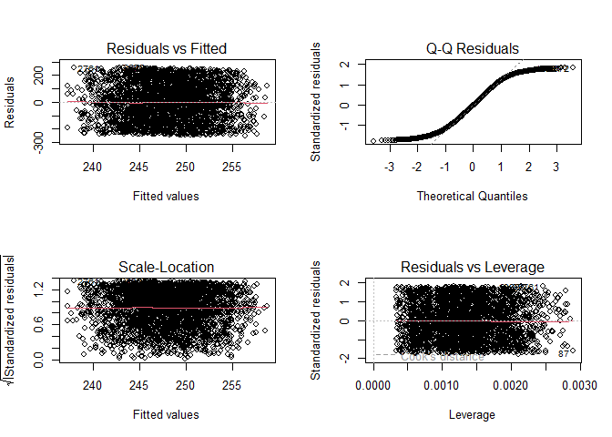<!-- -->

**The residuals are randomly scattered and deviate from normality. These
four plots are only giving stronger support to the findings we have
shown in this section. Hence, we can conclude that multiple regression
is not a good fit for modeling *Purchase_Time* with the predictors
*Browsing_Time*, *Number_of_Items*, and *Satisfaction_Score*.**
