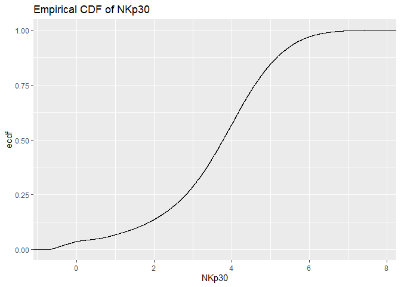
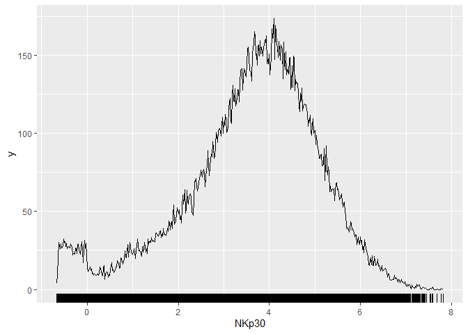
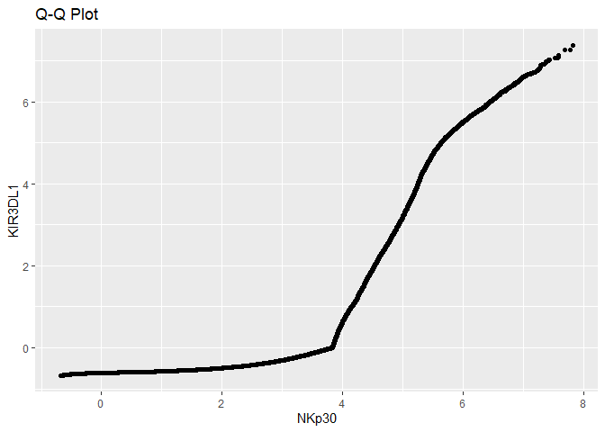

SEC 1-FA 1-MAYOL, J.
================
MAYOL, JOSE RAPHAEL J.
2025-02-01

# Overview

CyTOF (Cytometry by Time-Of-Flight) is a technique used in single-cell
analysis to measure the expression levels of various proteins on or in
individual cells. In practice, this tool quantifies the presence in
single cells of certain target antibodies tagged with metal isotopes for
detection. The data obtained from the CyTOF represents the abundance of
35 different antibodies in 50,000 distinct observations of single cells.
Negative values will eventually appear which correspond to estimations
of zeroes in the CyTOF, although they should still be treated as how
they appeared in the data. This study will be divided into two parts: an
investigation of the antibody ‘NKp30’ and a Q-Q plot comparison of the
antibodies ‘NKp30’ and ‘KIR3DL1.’

To begin, we need to initialize the needed libraries as well as the csv
file itself.

``` r
library(ggplot2)
library(tidyverse)
```

    ## ── Attaching core tidyverse packages ──────────────────────── tidyverse 2.0.0 ──
    ## ✔ dplyr     1.1.4     ✔ readr     2.1.5
    ## ✔ forcats   1.0.0     ✔ stringr   1.5.1
    ## ✔ lubridate 1.9.4     ✔ tibble    3.2.1
    ## ✔ purrr     1.0.2     ✔ tidyr     1.3.1
    ## ── Conflicts ────────────────────────────────────────── tidyverse_conflicts() ──
    ## ✖ dplyr::filter() masks stats::filter()
    ## ✖ dplyr::lag()    masks stats::lag()
    ## ℹ Use the conflicted package (<http://conflicted.r-lib.org/>) to force all conflicts to become errors

``` r
options(tibble.print_min = 15)
cytof = read.csv("C:/Users/Joel Mayol/Documents/Year3/EXPLORATORY DATA ANALYSIS/FA1/cytof_one_experiment.csv")
head(cytof)
```

    ##        NKp30    KIR3DL1      NKp44    KIR2DL1 GranzymeB       CXCR6      CD161
    ## 1  0.1875955  3.6156932 -0.5605694 -0.2936654  2.477893 -0.14470053 -0.3152872
    ## 2  1.0348518  1.7001820 -0.2889611 -0.4798280  3.261016 -0.03392447 -0.4112129
    ## 3  2.9996398  6.1411419  1.9032606  0.4823102  4.277562  1.94654156 -0.5022347
    ## 4  4.2998594 -0.2211586  0.2425707 -0.4831267  3.351808  0.92622195  3.8772370
    ## 5 -0.4386448 -0.5035892 -0.1526320  0.7506128  3.194145 -0.05893640  1.0907379
    ## 6  2.0883050 -0.3992646  3.4550676 -0.5200856  4.345102 -0.36434277 -0.5705891
    ##       KIR2DS4     NKp46      NKG2D      NKG2C       X2B4     CD69 KIR3DL1.S1
    ## 1  1.94497046 4.0818316  2.6200784 -0.3573817 -0.2711557 3.849965 -0.2554637
    ## 2  3.80251714 3.7339299 -0.4832788 -0.4675984 -0.5594752 2.910197 -0.2909482
    ## 3 -0.32010171 4.5594631 -0.5069090  2.6193782 -0.4554785 3.113454  3.6613886
    ## 4 -0.16969487 4.4831486  1.9272290 -0.3110146  1.6350771 3.045998  0.2871241
    ## 5 -0.05033025 0.8379358 -0.4581674  0.9216947  1.2419054 2.644422  0.4218294
    ## 6 -0.45033591 4.0550848  3.4283565  0.6272837 -0.4157104 3.958158  0.7993406
    ##          CD2    KIR2DL5    DNAM.1         CD4        CD8       CD57      TRAIL
    ## 1  5.3529769 -0.5092906 0.8811347 -0.32347280 -0.2822405  3.3254704 -0.6084228
    ## 2  4.3132510  3.7774776 1.5406568 -0.13208167  0.9161920  2.4946442 -0.5034739
    ## 3  5.5969513  0.8128166 1.0005903 -0.59933641  1.8382744  3.9897914 -0.2749380
    ## 4 -0.5002885  0.3612212 1.2663267 -0.12568567  0.7667204  1.9950916 -0.5130930
    ## 5 -0.5479527  1.0638327 0.8722272 -0.07107408 -0.1059012  3.4291302 -0.1433044
    ## 6  5.1028564  3.0918867 0.8717267 -0.47986180 -0.2577198 -0.5784575 -0.5731323
    ##       KIR3DL2      MIP1b     CD107a      GM.CSF       CD16        TNFa
    ## 1 -0.30668543  1.2497120 -0.1295305 -0.43074102  3.9951417  0.90143498
    ## 2 -0.54320954  2.8693060 -0.1887180 -0.16283845  4.4082309  1.93590153
    ## 3  2.06488239  4.0955112 -0.1998480  3.18853825  6.0023244 -0.02336999
    ## 4  2.11247859  3.3726018 -0.5720339  0.91310694  5.8238698 -0.60793749
    ## 5 -0.02505141 -0.3099826 -0.1068511 -0.60370379  4.0122501 -0.61989100
    ## 6 -0.28337673 -0.4108283 -0.1797545 -0.06372458 -0.5832926  0.14311030
    ##           ILT2 Perforin KIR2DL2.L3.S2      KIR2DL3      NKG2A    NTB.A     CD56
    ## 1 -0.386027758 6.431983    1.22710292  2.660657999 -0.5220613 4.348923 2.897523
    ## 2  2.983874845 6.814827   -0.04141081  3.841304627  4.6771149 3.474335 3.782870
    ## 3 -0.521099944 5.099562   -0.16705075 -0.009694396 -0.4730573 5.634341 5.701186
    ## 4 -0.043783559 5.841797   -0.51753289 -0.592990887 -0.4059049 4.598021 6.065672
    ## 5  1.182703288 4.888777   -0.36251589 -0.398123704 -0.5440881 3.606101 1.966169
    ## 6 -0.003258955 3.952542   -0.20194392 -0.202592720  3.8882776 2.346275 6.473243
    ##         INFg
    ## 1 -0.3841108
    ## 2  2.7186296
    ## 3  2.5321763
    ## 4  2.4564582
    ## 5  3.1470092
    ## 6  2.8282987

# I. Exploring NKp30

This section investigates the ‘NKp30’ column and is further divided into
two subsections: the ECDF and Density Estimate.

## ECDF

``` r
nkp30.gg = ggplot(cytof, aes(x = NKp30))
nkp30.gg + stat_ecdf() +
  xlab("NKp30") +
  ylab("ecdf") +
  ggtitle("Empirical CDF of NKp30")
```

<!-- -->

Looking at the graph, two long tails can be observed at around the
minimum and maximum values. This suggests that the observations for the
NKp30 antibody does not follow a normal distribution. At around the ‘3’
value, the cumulative probability starts to increase rapidly, indicating
a high frequency for the said area. The graph starts to slow down
slightly at ‘4’ then plateaus after ‘6’, signalling almost no presence
for the values thereafter. This may signify that the mean is in the 3-5
range.

## Density Estimate

``` r
ggplot(cytof, aes(x = NKp30)) +
  geom_density(adjust = 0.0001) +
  geom_rug(aes(y = 0), sides = "b",
           position = position_jitter(height = 0))
```

<!-- -->

The values for NKp30 does not appear to have a normal distribution.
Moreover, a minuscule amount of cells exhibit either extremely low or
extremely high NKp30 expression. The distribution also peaks at the ‘4’
mark and has a long tail especially on the right. These are all in line
with the observations made in the previous ECDF. An additional insight
made from the Density Estimate is that the behavior around the middle
part is particularly even and symmetrical, if the right-handed skewness
is ignored.

# II. NKp30-KIR3DL1 Comparison

## Q-Q Plot

``` r
qq.df <- as.data.frame(qqplot(cytof$NKp30, cytof$KIR3DL1, plot.it = FALSE))
ggplot(qq.df, aes(x = x, y = y)) +
  geom_point() +
  xlab("NKp30") + ylab("KIR3DL1") +
  labs(title = "Q-Q Plot")
```

<!-- -->

Since the Q-Q plot for NKp30 and KIR3DL1 deviates significantly from a
straight line, then this suggests that the data is not distributed
normally. Additionally, there is a sudden inflection point just before
the ‘4’ mark. This strongly indicates that the relationship between the
two antibodies is non-linear. Moreover, the sharp upward curvature
suggests that KIR3DL1 has higher extreme values than NKp30 or has more
outliers in the uppermost range. All in all, the data for NKp30 and
KIR3DL1 seem to follow different distributions.
